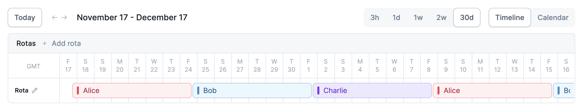

# Internships

incident.io has an internship programme for student engineers who want to gain
work experience over summer (3 month) or industrial (6 month) placements.

## What is the role?

This placement is for a Product Engineer role: [watch this
video](https://youtu.be/I7i8WabFHcY) to see how it differs from other roles.

We're looking for candidates that:

- Want to join a professional software engineering team to gain real world
  experience in the industry.
- Have great product taste and want to join a team where – alongside the
  challenge of building software – your skills thinking through product problems
  are equally valuable.
- Is excited by building software in the incident response space.

Do not apply if:

- You're looking for an 'intern' project: this placement will have you doing
  real work and we'll make little distinction between an intern vs a fulltime
  engineering hire.
- You don't enjoy learning new technologies by 'doing': we expect engineers to
  get involved building and learn as they go (most have learned Go while on the
  job, as an example).
- You prefer to work solo: we're highly collaborative and all your work will
  happen as part of a team.

## Applying

Please apply at [incident.io/careers](https://incident.io/careers), including a
CV detailing education and past experience and a cover letter that explains why
incident.io is particularly exciting to you.

We care more about the cover letter than the CV, so think carefully about why
this role is something you would do well in! Make sure to read [What is this
role?](#what-is-this-role) as we're looking for reasons you would be a good
match against that description.

> Pro-tip: you can get a sense of engineering at incident.io by reading our
> [engineering blog](https://incident.io/blog/engineering).

If your application is accepted, we'll invite you to choose one of two options
for the next part of the process.

These are:

## 1. Existing project you're proud of

Have you built something you're proud of, or think showcases skills that would
be valuable for this role?

If so, we invite you to submit this project in leiu of a take-home challenge.

An ideal project would:

- Be a software project that solves a real problem.
- Demonstrate your ability to build high-quality software.
- Provide enough context (often through a README) that would allow anyone
  grading your code to get setup and run it.

We'll only accept submissions where you are the primary contributor to the
project: group projects are great but become extremely difficult to evaluate
fairly!

## 2. Complete our take-home challenge

Instead, you could try solving the following code challenge.

### Intro

Imagine you're working at incident.io and we're building a product that can page
(call them, send an SMS, send a notification to a mobile app, etc) engineers
when their services are involved in an incident.

When configuring an on-call system, you don't want to say "whenever service X
goes down, page Y person" as that person probably has a social life and won't
appreciate receiving all the pages, all the time.

Instead, you want to build schedules: a set of people who take it in turns to
provide cover for a service by rotating through on-call shifts.

In JSON form, the configuration that describes how a schedule behaves might look
like this:

```js
// This is a schedule.
{
  "users": [
    "alice",
    "bob",
    "charlie"
  ],

  // 5pm, Friday 17th November 2023
  "handover_start_at": "2023-11-17T17:00:00Z",
  "handover_interval_days": 7
}
```

In that example, our schedule will rotate evenly between those users with the
first shift starting at 5pm Friday 17th, with shift changes happening every 7
days.

That means:

- Alice takes the shift for 1 week, starting at 5pm, Friday 17th November
- Then Bob is on-call for 1 week from 5pm, Friday 24th November
- Then Charlie, then...
- Back to Alice again.

Visually, this might look like this:



Schedule systems often support 'overrides' where you can add temporary shift
modifications to a schedule, such as if someone wants to go walk their dog or go
to the cinema.

An override specifies the person that will take the shift and the time period it
covers. An example of Charlie covering 5pm-10pm on Monday 20th November would
look like this:

```js
// This is an override.
{
  // Charlie will cover this shift
  "user": "charlie",
  // 5pm, Monday 20th November 2023
  "start_at": "2023-11-20T17:00:00Z",
  // 10pm, Monday 20th November 2023
  "end_at": "2023-11-20T17:00:00Z"
}
```

### Task

We would like you to build – in any language you choose, but ideally one you are
very comfortable in – a script called `./render-schedule` that implements a
scheduling algorithm.

It should be run like so:

```console
$ ./render-schedule \
    --schedule=schedule.json \
    --overrides=overrides.json \
    --from='2023-11-17T17:00:00Z' \
    --until='2023-12-01T17:00:00Z'
[
  {
    "user": "alice",
    "start_at": "2023-11-20T17:00:00Z",
    "end_at": "2023-11-20T17:00:00Z"
  },
  {
    "user": "bob",
    "start_at": "2023-11-20T17:00:00Z",
    "end_at": "2023-12-01T17:00:00Z"
  }
]
```

Where:

- `--schedule` JSON file containing a definition of a schedule (see above example)
- `--overrides` JSON file containing an array of overrides (see above example)
- `--from` the time from which to start listing entries
- `--until` the time until which to listing entries

The script should output a JSON array of final schedule as a list of entries.
This should take into account the projected entries (based on the handover
information in the schedule) alongside the provided overrides.

Your schedule should also be truncated based on the from/until parameters
provided. For example, if an entry was from 1pm November 17 -> 1pm November
19th, but from was 2pm November 18th, the entry should be returned as 2pm
November 18th -> 1pm November 19th (ignoring the part of the entry that is
outside the provided range).

Entries should be truncated to match the from/until parameters.

### Code submission

Please submit your code in a zip file (TODO: how do we want this to work?)

Your submission should include a `README.md` that includes:

- Instructions on running your code, including installation of dependencies.
- Comments on code structure/how you approached the problem you think may be
  useful.
- Thoughts about how you might use what you built in a real scheduling product,
  one that supports tracking historical entries along with projecting future
  ones.

The last question is not looking to be comprehensive or provide full solutions:
it's more about "imagine we were adapting this into a real schedule product, how
would we":

- Capture historic shifts?
- Incorporate history into our algorithm?
- What might be the challenges in building a system like this?
